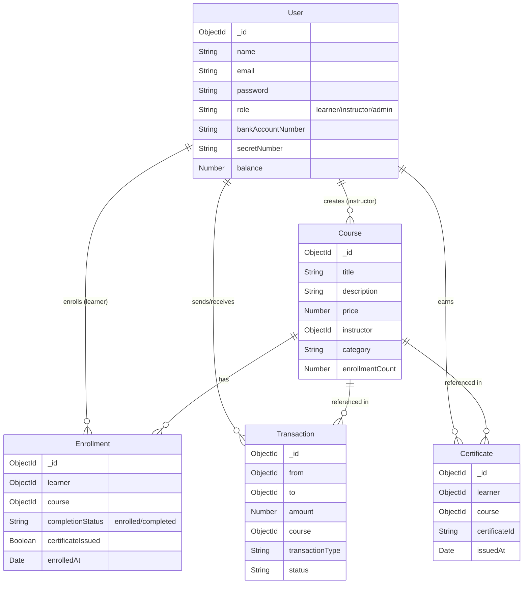

# 🎓 LMS - Learning Management System

A full-stack Learning Management System (LMS) with course enrollment, secure payments, and certificate generation.

## 📋 Features

### For Learners
- 🔐 User registration and authentication
- 📚 Browse and view courses
- 💳 Enroll in courses with secure bank payment
- 🏆 Earn certificates upon course completion
- 📊 Personal dashboard with enrolled courses and certificates
- 💰 Transaction history tracking

### For Instructors
- 📝 Create and manage courses
- 💸 Receive payments for course uploads
- 📈 Track student enrollments
- 💵 View earnings and statistics

### For LMS Organization
- 🏢 Manages platform and payments
- 🔄 Facilitates transactions between learners and instructors

## 🛠️ Technology Stack

### Backend
- **Node.js** - Runtime environment
- **Express.js** - Web framework
- **MongoDB** - Database
- **Mongoose** - ODM
- **JWT** - Authentication
- **bcryptjs** - Password hashing

### Frontend
- **HTML5** - Structure
- **CSS3** - Modern styling with glassmorphism
- **JavaScript** - Interactivity
- **Google Fonts (Inter)** - Typography

## 📁 Project Structure

```
lms-project/
├── backend/
│   ├── config/          # Database and JWT config
│   ├── controllers/     # Route handlers
│   ├── middleware/      # Auth and error handling
│   ├── models/          # Database models
│   ├── routes/          # API routes
│   ├── utils/           # Bank simulator and seed data
│   ├── server.js        # Entry point
│   └── package.json
│
├── frontend/
│   ├── css/
│   │   └── main.css    # Main stylesheet
│   ├── js/
│   │   ├── api.js      # API service layer
│   │   └── utils.js    # Utility functions
│   ├── index.html      # Landing page
│   ├── login.html
│   ├── register.html
│   ├── courses.html
│   ├── course-details.html
│   ├── learner-dashboard.html
│   └── instructor-dashboard.html
│
└── README.md
```

## 🚀 Getting Started

### Prerequisites
- Node.js (v14 or higher)
- MongoDB (local or Atlas)
- npm or yarn

### Installation

1. **Clone the repository**
```bash
cd "Web 1"
```

2. **Setup Backend**
```bash
cd backend
npm install
cp .env.example .env
```

3. **Configure Environment**

Edit `backend/.env`:
```env
PORT=5000
MONGODB_URI=mongodb://localhost:27017/lms-db
JWT_SECRET=your_super_secret_jwt_key
NODE_ENV=development
```

4. **Start MongoDB**
```bash
# If using local MongoDB
mongod
```

5. **Seed Database**
```bash
npm run seed
```

6. **Start Backend Server**
```bash
npm run dev
```

Backend will run on `http://localhost:5000`

7. **Open Frontend**

Open `frontend/index.html` in a browser or use a live server:
- VS Code: Install "Live Server" extension and right-click on `index.html` → "Open with Live Server"
- Or use Python: `cd frontend && python3 -m http.server 8000`

Frontend will be available at `http://localhost:8000` (or your live server URL)

## 👥 Test Accounts

### Learner Account
- **Email**: learner@test.com
- **Password**: learner123
- **Bank Account**: ACC999
- **Secret Number**: SECRET999
- **Initial Balance**: $15,000

### Instructor Accounts
- **Email**: john@instructor.com
- **Password**: instructor123

- **Email**: sarah@instructor.com
- **Password**: instructor123

- **Email**: michael@instructor.com
- **Password**: instructor123

### Admin/LMS Organization
- **Email**: admin@lms.com
- **Password**: admin123

## 🔌 API Endpoints

### Authentication
```
POST   /api/auth/register      # Register new user
POST   /api/auth/login         # Login user
PUT    /api/auth/setup-bank    # Setup bank information
GET    /api/auth/me           # Get current user
```

### Courses
```
GET    /api/courses                    # Get all courses
GET    /api/courses/:id                # Get single course
POST   /api/courses                    # Create course (instructor)
PUT    /api/courses/:id                # Update course (instructor)
DELETE /api/courses/:id                # Delete course (instructor)
GET    /api/courses/my/instructor      # Get instructor's courses
```

### Enrollments
```
POST   /api/enrollments                # Enroll in course (learner)
GET    /api/enrollments/my             # Get learner's enrollments
PUT    /api/enrollments/:id/complete   # Mark course as completed
```

### Transactions
```
GET    /api/transactions/my            # Get user's transactions
GET    /api/transactions/:id           # Get transaction details
```

### Certificates
```
GET    /api/certificates/my            # Get learner's certificates
GET    /api/certificates/:id           # Get certificate by ID
```

## 💡 Usage Guide

### As a Learner

1. **Register**: Go to sign up page and create account with bank details
2. **Browse Courses**: View available courses on the courses page
3. **Enroll**: Click on a course and enroll with your secret number
4. **Complete**: Mark courses as completed to earn certificates
5. **View Certificates**: Check your certificates in the dashboard

### As an Instructor

1. **Register**: Sign up as an instructor
2. **Create Course**: Use the "Create New Course" button in dashboard
3. **Get Paid**: Receive $500 payment automatically when uploading a course
4. **Track Earnings**: View enrollments and total earnings in dashboard

## 🔒 Security Features

- Password hashing with bcrypt
- JWT-based authentication
- Protected routes with middleware
- Bank secret number validation
- Role-based access control

## 🎨 Design Features

- Modern dark theme
- Glassmorphism effects
- Smooth animations and transitions
- Responsive design
- Beautiful gradient buttons
- Toast notifications
- Modal dialogs

## 📊 Database Models

### User
- name, email, password (hashed)
- role (learner/instructor/admin)
- bankAccountNumber, secretNumber
- balance

### Course
- title, description, price
- instructor (ref User)
- category, duration, materials
- enrollmentCount

### Enrollment
- learner (ref User)
- course (ref Course)
- completionStatus, certificateIssued

### Transaction
- from (ref User), to (ref User)
- amount, course (ref Course)
- transactionType, status

    certificateId, issuedAt

## 🗄️ Database Schema



## 🧪 Testing

### Backend Testing
```bash
cd backend
npm test
```

### Manual Testing
1. Register as learner and instructor
2. Create courses as instructor
3. Enroll in courses as learner
4. Complete course and verify certificate
5. Check transaction history

## 📝 Project Requirements Checklist

- ✅ Three entities (Learner, Instructor, E-commerce Org)
- ✅ 5 courses by 3 instructors
- ✅ User authentication (login/register)
- ✅ Bank information setup
- ✅ Course viewing and enrollment
- ✅ Payment processing with bank validation
- ✅ Transaction recording
- ✅ Certificate generation
- ✅ Instructor payment on course upload
- ✅ RESTful API design
- ✅ Modern, beautiful UI

## 🤝 Contributing

This is a student project. Feel free to fork and modify for learning purposes.

## 📄 License

ISC

## 👨‍💻 Author

Built with Ridoy Baidya ❤️ for LMS API Project Assignment

---

