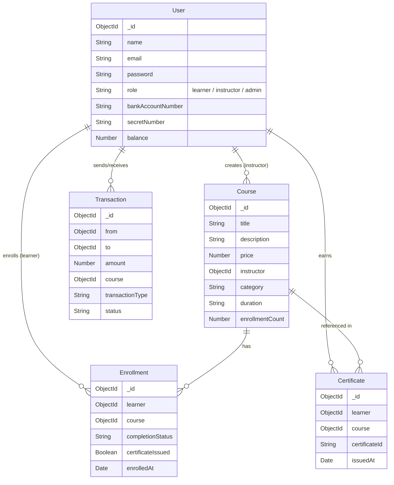

# 🎓 LMS - Learning Management System

A full-stack Learning Management System with course management, secure payments, certificate generation, and **PDF certificate downloads**.

[](https://nodejs.org/)
[](https://www.mongodb.com/)
[](LICENSE)

---

## 📋 Features

| Role | Features |
|------|----------|
| **Learner** | Register, browse courses, enroll with bank payment, earn & **download PDF certificates** |
| **Instructor** | Create/edit/delete courses, track enrollments, view earnings |
| **Admin/LMS Org** | Facilitates payments between learners and instructors |

---

## 🛠️ Technology Stack

### Backend
- **Node.js** + **Express.js** — REST API server
- **MongoDB** + **Mongoose** — Database & ODM
- **JWT** — Authentication
- **bcryptjs** — Password hashing

### Frontend
- **HTML5 + CSS3 + JavaScript** — Vanilla, no framework needed
- **jsPDF** (CDN) — PDF certificate generation
- **Google Fonts (Inter)** — Typography

---

## 📁 Project Structure

```
LMS-Web-Project--2/
├── backend/
│   ├── config/
│   │   ├── db.js              # MongoDB connection
│   │   └── jwt.js             # JWT helpers
│   ├── controllers/
│   │   ├── authController.js
│   │   ├── courseController.js
│   │   ├── enrollmentController.js
│   │   ├── certificateController.js
│   │   └── transactionController.js
│   ├── middleware/
│   │   ├── auth.js            # JWT protect & role guard
│   │   └── errorHandler.js
│   ├── models/
│   │   ├── User.js
│   │   ├── Course.js
│   │   ├── Enrollment.js
│   │   ├── Transaction.js
│   │   └── Certificate.js
│   ├── routes/                # API route files
│   ├── utils/
│   │   ├── bankSimulator.js
│   │   └── seedData.js
│   ├── server.js              # App entry point
│   ├── .env                   # Environment variables (not committed)
│   └── package.json
│
├── frontend/
│   ├── css/
│   │   └── main.css
│   ├── js/
│   │   ├── api.js             # All API calls in one place
│   │   └── utils.js           # Shared helper functions
│   ├── index.html             # Landing page
│   ├── login.html
│   ├── register.html
│   ├── courses.html
│   ├── course-details.html
│   ├── learner-dashboard.html
│   └── instructor-dashboard.html
│
├── start_project.sh           # One-command startup script
└── README.md
```

---

## 🚀 How to Run

### Prerequisites

Make sure you have these installed:
- [Node.js v14+](https://nodejs.org/)
- [MongoDB](https://www.mongodb.com/try/download/community) (local) or a MongoDB Atlas URI
- [npm](https://www.npmjs.com/) (comes with Node.js)
- Python 3 (for the frontend server — comes pre-installed on Linux/Mac)

---

### Step 1 — Clone the Repository

```bash
git clone https://github.com/rid-coder-70/LMS-Web-Project--2.git
cd LMS-Web-Project--2
```

---

### Step 2 — Configure Backend Environment

```bash
cd backend
cp .env.example .env
```

Open `backend/.env` and fill in:

```env
PORT=5000
MONGODB_URI=mongodb://localhost:27017/lms-db
JWT_SECRET=your_super_secret_jwt_key_here
NODE_ENV=development
```

> 💡 **MongoDB Atlas?** Replace `MONGODB_URI` with your Atlas connection string.

---

### Step 3 — Install Backend Dependencies

```bash
# Inside /backend
npm install
```

---

### Step 4 — Start the Backend Server

```bash
# Inside /backend
npm run dev
```

✅ Backend runs at → **http://localhost:5000**

You'll see:
```
🚀 Server running on port 5000
📡 API URL: http://localhost:5000
```

---

### Step 5 — Start the Frontend Server

Open a **new terminal** and run:

```bash
cd frontend
python3 -m http.server 8000
```

✅ Frontend runs at → **http://localhost:8000**

> **Windows users:** Use `python -m http.server 8000` or install VS Code's [Live Server](https://marketplace.visualstudio.com/items?itemName=ritwickdey.LiveServer) extension.

---

### Quick Start (Both servers together)

```bash
# Run from the project root
bash start_project.sh
```

---

### Verify It's Working

| Check | URL |
|-------|-----|
| Backend API | http://localhost:5000 |
| Frontend Home | http://localhost:8000/index.html |
| All Courses | http://localhost:8000/courses.html |

---

## 🔌 API Endpoints

### Auth
```
POST  /api/auth/register       Register new user (learner or instructor)
POST  /api/auth/login          Login
PUT   /api/auth/setup-bank     Add bank account info
GET   /api/auth/me             Get current logged-in user
```

### Courses
```
GET    /api/courses                  List all courses (public)
GET    /api/courses/:id              Get one course (public)
POST   /api/courses                  Create course (instructor only)
PUT    /api/courses/:id              Edit course (instructor only)
DELETE /api/courses/:id              Delete course (instructor only)
GET    /api/courses/my/instructor    My courses (instructor only)
```

### Enrollments
```
POST  /api/enrollments              Enroll in a course (learner)
GET   /api/enrollments/my           Get my enrollments (learner)
PUT   /api/enrollments/:id/complete Mark course complete (learner)
```

### Transactions
```
GET  /api/transactions/my    My transaction history
GET  /api/transactions/:id   Get one transaction
```

### Certificates
```
GET  /api/certificates/my    My certificates (learner)
GET  /api/certificates/:id   Get one certificate
```

---

## 👥 Test Accounts (after seeding)

Run `npm run seed` inside `/backend` to populate the database.

| Role | Email | Password |
|------|-------|----------|
| Learner | learner@test.com | learner123 |
| Instructor | john@instructor.com | instructor123 |
| Admin | admin@lms.com | admin123 |

> Or just **register a new account** — it works without seeding.

---

## 💡 Usage Guide

### As a Learner
1. Register at `/register.html` — choose **Learner**, fill in bank details
2. Browse courses at `/courses.html`
3. Click a course → **Enroll Now** → enter your PIN → enrolled!
4. Go to dashboard → click **Mark as Complete**
5. 🏆 Certificate appears — click **📥 Download PDF** to get your certificate!

### As an Instructor
1. Register at `/register.html` — choose **Instructor**
2. Dashboard → **+ Create New Course** → fill in details
3. Click ✏️ to edit or 🗑️ to delete any course
4. Track student enrollments and earnings in the stats cards

---

## 📊 Database Schema



---

## 🔒 Security

- Passwords hashed with **bcrypt**
- Routes protected by **JWT middleware**
- Role-based access control (`instructor` / `learner` / `admin`)
- Bank secret number validated before payment

---

## 🐛 Troubleshooting

| Problem | Fix |
|---------|-----|
| `Address already in use` on port 8000 | Run `fuser -k 8000/tcp` then retry |
| `Cannot connect to MongoDB` | Make sure `mongod` is running |
| Frontend shows blank page | Check backend is running on port 5000 |
| Can't create course as instructor | Make sure you're logged in as **instructor** role |

---

## 📝 Changelog

### v1.1.0 — Latest
- ✅ Fixed: Instructors can now create courses even without an admin user in the DB
- ✅ Added: Edit course (✏️) fully implemented with pre-filled form
- ✅ Added: **PDF certificate download** (jsPDF, landscape A4, gold border design)
- ✅ Fixed: Dashboard crash guards when API returns error objects
- ✅ Fixed: Register page correctly hides bank info for instructors

### v1.0.0
- Initial release: auth, courses, enrollments, certificates, transactions

---

## 🤝 Contributing

This is a student project. Fork it, learn from it, build on it!

## 📄 License

ISC

## 👨‍💻 Author

Built with ❤️ by **Ridoy Baidya** — LMS API Assignment
